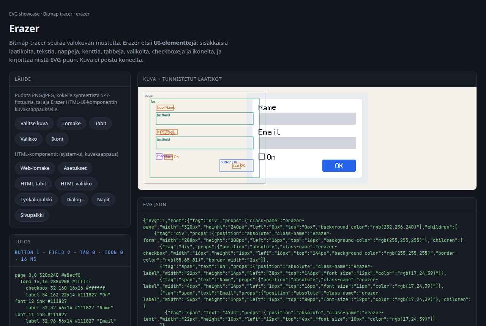
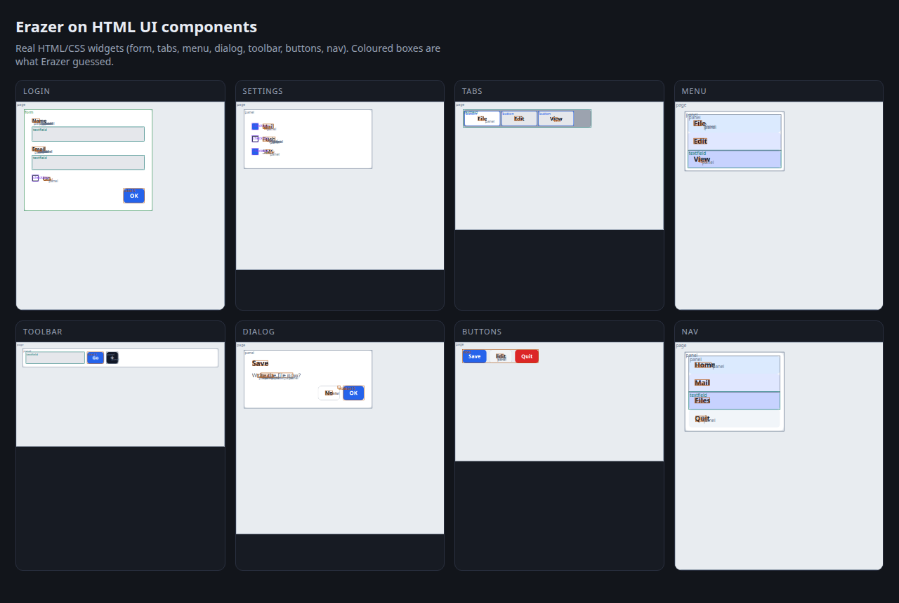

# Erazer

A **bitmap UI screenshot → EVG layout** tool, written in
[Ranger](https://github.com/terotests/Ranger). Ranger's EVG library already has
[`EvgBitmapTracer`](https://github.com/terotests/Ranger/blob/master/lib/evg/EvgBitmapTracer.rgr) for photographs: it follows ink
and emits paths. Erazer looks at the same pixels and asks a different question —
which **widgets** are here, how they nest, and what EVG tree would reconstruct
the screen.

**License: AGPL-3.0-or-later** (see `LICENSE`).

Live page: <https://terotests.github.io/Erazer/>

## Building

The sources expect to sit at `gallery/erazer/` inside a Ranger checkout: they
use Ranger's compiler (`dist/rgrc.js`), `lib/evg`, `lib/image` and the test
harness under `gallery/game_engine/v2/tests/harness/`.

```sh
git clone https://github.com/terotests/Ranger
git clone https://github.com/terotests/Erazer Ranger/gallery/erazer
cd Ranger
node gallery/erazer/web/build.mjs --out _site   # the live page
```

`.github/workflows/pages.yml` does the same on every push to `main`: it takes a
sparse, shallow checkout of Ranger (`compiler/`, `lib/`, `dist/`,
`scripts/`, the test harness — no `npm ci`), places this repository at
`gallery/erazer`, runs the tests and the bundle smoke test, and deploys the page
to GitHub Pages. The Ranger ref is `RANGER_REF` in the workflow (`master`);
a manual run can override it.

## What it looks for

| Kind | How it is guessed |
| --- | --- |
| Nested panels | Connected components of similar colour, then bbox containment. A region grown from a flat seed uses the tight `surfaceTol` (8), so a white card on an off-white page is its own panel; it may drift further (`surfaceDrift`) in small steps over flat pixels, so a blurred or gradient backdrop stays one surface |
| Layers | Where two region boxes cross (neither holds the other), the one holding fewer regions is `backdrop` — a piece of the page's own surface between cards. Backdrop goes into one `underlay` node, the page's first child, drawn under the content; nothing nests inside it |
| Text | Small ink runs clustered onto a baseline; font size from glyph height, colour from the ink. Touching fragments (an anti-aliased letter's core, fringe and counter) are joined first |
| Not text | A run inside a switch, checkbox, slider or icon is part of the control (a knob's shadow crescent) and is dropped. A single tall mark far above the page's median font size, or ink within 24 luma of the pixels just outside it, becomes a `shape`: geometry and colour, no text |
| Corners and fills | Border radius from the four corners' diagonal inset (× 3.41, median of the corners). A big surface whose first and last quarters differ gets a two-stop `gradient-from` / `gradient-to` / `gradient-dir`. A child the colour of its parent (a row on its card) emits no fill of its own |
| Characters | A 5×7 atlas (the same face the tests paint with). On a real screenshot the run, size and colour still land; a reading whose cells match the atlas poorly is dropped rather than shown as noise |
| Button | Compact rectangle, centred label, often an accent fill. Several same-row chips of the same height and fill with one-line labels are promoted together, even when one is too wide or OCR-split to classify alone |
| Text field | Wide light rectangle, left-aligned text or empty interior, optional border |
| Checkbox | Small square, solid or a hollow frame |
| Switch | A pill about twice as wide as tall with a round knob at one end |
| Slider | Wide thin track with a circular thumb on the bar, or a filled part beside an empty one. A lone thin bar (a home indicator, a divider) is not a slider |
| List rows | Hairlines across most of a card split it into `listitem` rows; bands stacked edge to edge are rows too. The card becomes a `list` |
| Tabs | Three or more sibling labelled bars on one row |
| Menu | Three or more stacked labelled rows |
| Form | A panel that holds two or more fields |
| Icon | A small non-text mark; vectorized with `EvgBitmapTracer` to SVG / EVG paths |

The EVG tree uses `position: absolute` so the reconstruction keeps the
screenshot's geometry. To see the reconstruction, render the result:
`node gallery/pdf_writer/bin/evg_png_tool.js out.evg.json out.png -w W -h H`
(build it once with `npm run agent:render`; the name must end `.evg.json`).
Each node carries `class-name` `erazer-button`,
`erazer-textfield`, `erazer-checkbox`, `erazer-tab`, `erazer-menu`, …
so a later pass can restyle it.

## Text from an outside OCR

The built-in reader knows only the 5×7 test face. For a real screenshot
the live page has **Lue teksti (OCR)**: it loads
[Tesseract.js](https://github.com/naptha/tesseract.js) from jsDelivr on
first use (about 5 MB, then cached by the browser), reads the image in the
browser and hands the words to Erazer. The image still does not leave the
machine. On the command line, give Tesseract's own TSV:

```sh
tesseract shot.png words tsv            # writes words.tsv
npm run erazer -- shot.png out.evg.json --words words.tsv --outline
```

Each OCR line, split where a gap is wider than two word heights, becomes
a label in the smallest box that holds it. The region pass's runs and
letter pieces under it go. A word inside a control (a switch knob read
as "J"), a lone tall character, and words under `--wordMinConf` (55) are
dropped. The label's height comes from its ink, and its CSS `font-size`
from that height and the letters it has (ascenders, descenders). Every
label gets a `text-align`: an edge it shares with a sibling label (the
lines of a paragraph), otherwise the side of its container it hugs, or
`center` when both margins match.

The page draws the EVG tree back as plain DOM under **Rekonstruktio**, so
text, alignment, radii and gradients can be checked against the screenshot.

## Layout net (geometry, not pixels)

Erazer already has primitive boxes and a widget type. A second, tiny
network ranks **groups** of those boxes:

```
primitives → em / relative features → 2-layer MLP → list | form | toolbar | …
```

Grouping stays heuristic (same edge, regular gap, repeating child
pattern). Candidates only group boxes that share a container, a column
breaks where a gap is wider than three em, and each container's direct
children are one more candidate (a row's label and switch). The net only names a candidate and returns an abstract
structure: axis, item count, alignment, spacing in `em`, member
indices. A user selection plus a name is one training point; gap,
scale, font-size and leave-one-out jitter expand it to a dozen
samples, with axis-flips as hard negatives.

The live page: click boxes, pick `lista` / `toolbar` / a new concept,
**Opeta valinta**. Or **Rakenna HTML-testsetti**: it renders the known
widgets from `web/components.html`, records DOM boxes, rasterises HTML →
PNG, vectorises with Erazer, and stores labelled samples in IndexedDB.
When at least 8 samples exist, **Kouluta WebGPU:lla** trains the same
tiny 40→32→8 net (CPU fallback if the adapter is missing). **Tallenna
malli** / **Lataa malli** keep weights in IndexedDB, `localStorage`, or a
`.txt` file.

A fine-tune **continues from the weights the page is already predicting
with**, and the eight synthetic archetypes ride along in the corpus. The
HTML fixtures cover six of the eight classes and carry three toolbars
against one of everything else, so a run that starts from random weights
on those alone forgets the rest: a four-label column came back `nav` at
100% and the archetypes fell from 8/8 to 2/8 — saved to IndexedDB, so one
click degraded the page until site data was cleared.

The run is then **scored before it is adopted**, over the archetypes and
every recorded sample. A candidate that loses ground on either is
reported and thrown away; the weights on the page do not move. `npm run
erazer:web:lab` drives that whole path in a real browser.

## Commands

Run from the Ranger checkout root; the scripts are in Ranger's `package.json`.

```sh
npm run erazer:test                 # synthetic UI fixtures (form, tabs, menu, icon)
npm run erazer -- in.png out.evg.json
npm run erazer -- in.png out.evg.json --overlay boxes.svg --outline
npm run erazer -- in.png out.evg.json --words words.tsv   # tesseract in.png words tsv
npm run erazer:web:serve            # live page at http://localhost:8008/
npm run erazer:web:smoke            # the bundle's exports, in Node
npm run erazer:web:lab              # the live page, in a browser: capture + train
npm run erazer:shots                # HTML widgets + live-page PNGs
```

`--ocr false` still reports where the text is and how tall and what colour;
it skips the atlas. `--vectorizeIcons false` leaves icons as labelled boxes.

The live page paints the same fixtures the tests use — a form, tabs, a menu,
a plus icon, a chip row, sliders — and accepts a PNG/JPEG/WebP from the file picker, the camera,
a paste (`Ctrl/⌘+V` or the **Liitä** button) or a drop. Nothing is uploaded.
On a phone **Valitse kuva** opens Kuvat; a screenshot can be pasted after a
long-press. Live on GitHub Pages:

<https://terotests.github.io/Erazer/>

## What it looks like

Live page, synthetic 5×7 form (the same fixture the tests paint):



Three tabs, labelled File / Edit / View:


HTML/CSS widgets (login, settings, tabs, menu, toolbar, dialog, buttons, nav)
with Erazer's overlay on top:



A login form screenshot in the live page:


Dark **shadcn/ui**-shaped widgets (zinc cards, pill buttons, nav, bar chart, balance):


The full dashboard overlay:


The same dashboard in the live page (`?png=shadcn-dash.png`):


## Files

| File | |
| --- | --- |
| `Erazer.rgr` | region grow, nesting, heuristics, EVG emit |
| `ErazerTypes.rgr` | options, regions, the result tree |
| `ErazerLayout.rgr` | em-features, candidate groups, 2-layer MLP |
| `ErazerFont.rgr` | 5×7 face: paint and read |
| `ErazerPaint.rgr` | synthetic UI-library screenshots |
| `erazer_cli.rgr` | PNG/JPEG in, `.evg.json` out |
| `ErazerTest.rgr` | the fixtures, asserted |
| `web/layout-lab.js` | HTML fixtures → boxes → WebGPU/CPU fine-tune, with the adoption gate |
| `web/lab-check.mjs` | the lab driven in a real browser |
| `web/` | the live page |
| `web/layout-lab.js` | HTML test-set capture + WebGPU trainer |
| `web/components.html` | HTML/CSS widgets for `erazer:shots` |
| `web/shadcn.html` | dark zinc shadcn/ui-shaped dashboard |
| `shots/` | captured PNGs the live page can load |

It is a heuristic. A photograph of a Mac settings panel will not come back as
production TSX. The claim the tests make is narrower and checkable: when the
input is a form, the tree has fields, a button, a checkbox and the labels
`Name` / `Email` / `OK`; when the input is three tabs, there are three tabs.
